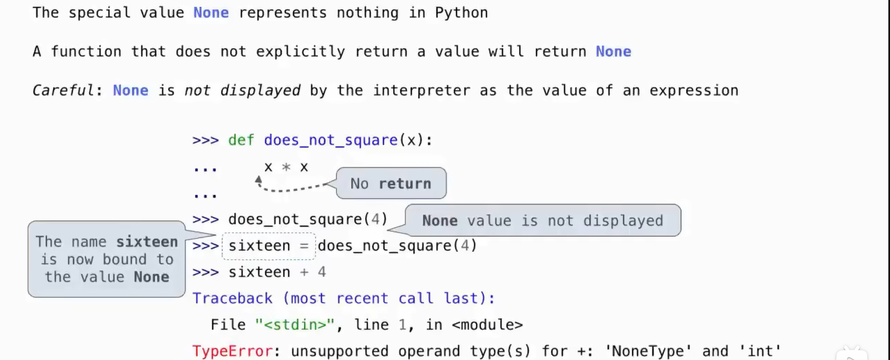
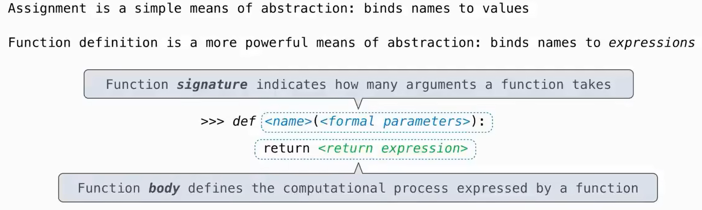
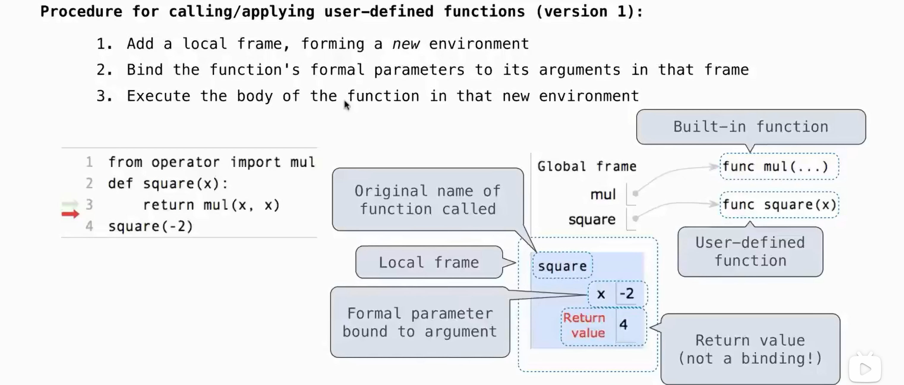
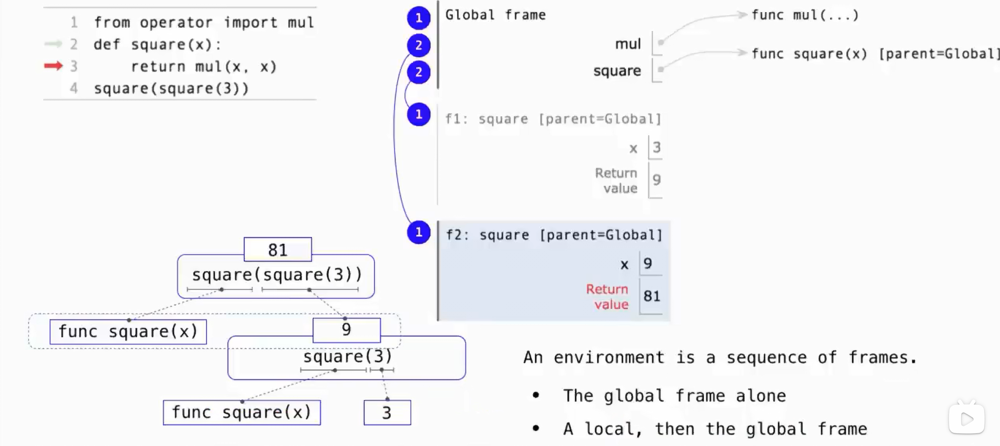
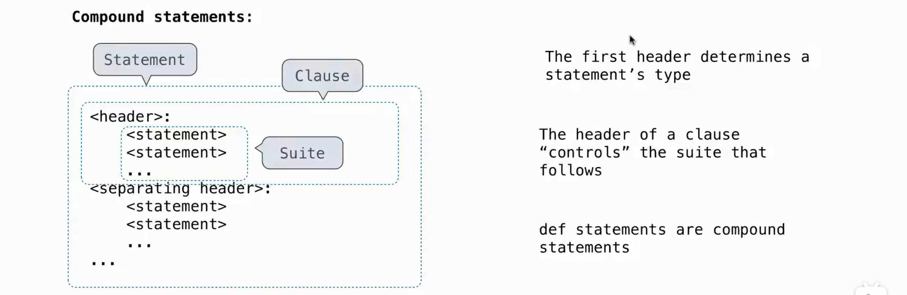
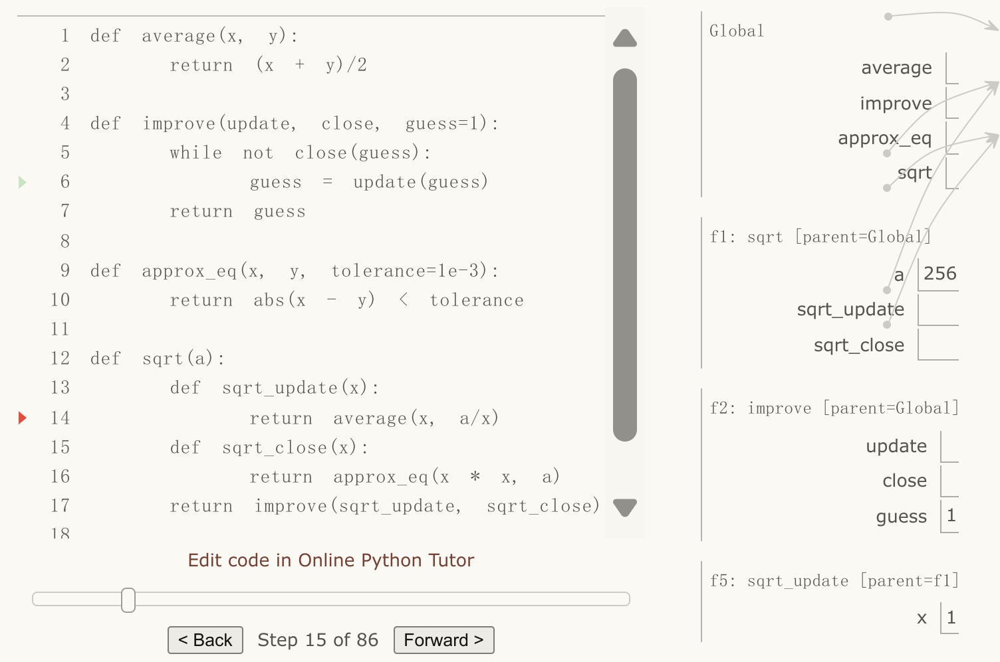
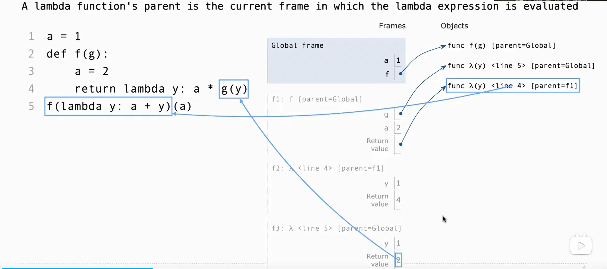

# <center> Chapter 1: Building Abstractions with Functions
---
# 1.1 Getting Started
---
## Introduction
**Statements & Expressions**
**Functions**
Functions encapsulate logic that manipulates data
**Objects**
An object seamlessly bundles together data and the logic that manipulates that data
**Interpreters**
Evaluating compound expressions requires a precise procedure that interprets code in
a predictable way. A program that implements such a procedure, evaluating compound expressions,
is called an interpreter.
>functions are objects,
objects are functions, and interpreters are instances of both

## Errors
**Test incrementally**
**Isolate errors**
**Check your assumptions**

#### Types of Errors 
intepreter shows the line where the problem first detected, not necessarily the line needed to be updated!
- **syntax errors**
- **runtime errors**
  Traceback
- **logic / behavior errors**: can't be deteced by the inrepreter


---
# 1.2 Elements of Programming
---
## Methchanisms
**primitive expressions and statements**, which represent the simplest building blocks that the language provides
**means of combination**, by which compound elements are built from simpler ones
**means of abstraction**, by which compound elements can be named and manipulated as units.
## Expressions
### Primitive expressions
Numbers
combined with mathematical operators
### Call Expressions
subexpressions: the operator is an expression that precedes parentheses,
which enclose a comma-delimited list of operand expressions.
**operator** :function
**operands** :parameter

**intepreter procedure:**
1. find the value of operator & operands
2. apply the function to the parameters
```py
def if_(c, x, y):
    if c:
        return x
    else:
        return y

def real_sqrt(x):
    return if_(x >=0, sqrt(x), 0)
```

```bash
>>>real_sqrt(-16)
error   # think why!!
```
### Nested Expressions
recursive in nature
**expression tree**
What we need to evaluate are *not call expressions, ==but primitive expressions such as numerals (e.g., 2) and names (e.g.add).==*
## Library Functions
import statements
## Names
#### bind name to value / function
- assignment statement
- import statement
- function definition

Both def statements and assignment statements bind names to values, and any existing bindings are lost
```py
f = max
max = 5
f(1,2)
```

All expressions to the right of = are evaluated before any names to the left
are bound to those values. 
```py
x, y = 3, 4.5
y, x = x, y
```
## Environment
memory that keeps track of the names, values, and bindings
An environment consists of a sequence of **frames**
Each frame contains bindings
- 1 global frame
- local frames
- ...
---
# 1.3 Function
---
## Type
**Pure functions** 
Functions have some input (their arguments) and return some output (the result of applying them).
**Non-pure functions** 
In addition to returning a value, applying a non-pure function can generate side effects, which make some change to the state of the interpreter or computer.
The value that print returns is always None
```bash
>>> print(print(1), print(2))
1
2
None None
```

about **None**:


## Name
- intrinsic name
- bound name
## Component

**Function Signatures**
A description of the formal parameters
all built-in functions will be rendered as `<name>(...)`, because these
primitive functions were never explicitly defined.
## Calling User-Defined Functions

nested calling

⚠️the inside `square` is called before the outside `square` , its frame being built earlier too 
(remember the logic of **call expression**!!!)
>What we need to evaluate are *not call expressions, but primitive expressions such as numerals (e.g., 2) and names (e.g.add).*

**Name Evaluation**
- parameter:
the meaning of a function should be independent of the parameter names chosen by its author
--> the parameter names of a function must remain local to the body of the function.
only 2 approaches:
1.passed -> 2. **Default Argument Values**

    ```py
    def pirate(arggg):  #this parameter is never used
        def plunder(arggg):
            return arggg    # plunder is identity function        
        return plunder
    ```
    ```bash
    >>>pirate(pirate(pirate))(3)
    3   # regardless of the parameter, the return value of pirate is identity function
    ```
    the `arggg` in plunder can't be fetched from pirate since it's a parameter!!!

- var in body:
LEGB (Local → Enclosing → Global → Built-in)
## Functions as Abstractions
relies only on the relationship between its input arguments and its output values (& side effects).
"black box"
#### Aspects of a functional abstraction
- **domain**: arguments
- **range**: return value
- **intent**: relationship between inputs and output (& side effects)
## Operators
short-hand for call expressions
e.g
`/`: truediv
`//`: floordiv
`%`: mod

---
# 1.4 Designing Functions
---
## Principle
- exactly ***one job***
- Don't repeat yourself
- defined ***generally***
## Documentation
**docstring**: documentation describing the function
- indented along with the function body.
- triple quoted
- first line describes the job of the function in one line
- following lines describe arguments and clarify the behavior of the function
  
---
# 1.5 Control
---

## Statements
Statements govern the relationship among different expressions in a program and what happens to their results.

Expressions can also be executed as statements, in which case they are evaluated, but their value is discarded

**Control statements**
control the flow of a program's execution based on the results of logical comparisons
## Compound Statements
A **simple statement** is a single line that doesn't end in a colon



## Boolean
#### Boolean contexts
- false values: 0, None, boolean value False. 
- true value: other

#### Boolean values
`True` & `False`
Functions that perform comparisons and return boolean values typically begin with `is`
#### Boolean operators
`and` `or` `not`

**short-circuiting**
```py
def has_big_sqrt(x):
    # wrong: return sqrt(x) > 10
    return x > 0 and sqrt(x) > 10
```
- not: return Boolean value
- and & or: return the value of *the last subexpression evaluated*
## Conditional Statements
```py
if <expression>:
    <suite>
elif <expression>:
    <suite>
else:
    <suite>
```
## Iteration
```py
while <expression>:
    <suite>
```
## Testing
A test that applies a single function is called a **unit test**
- write (and run) tests immediately after implementing new functions.
- even good practice to write some tests before you implement

#### Assertions
```py
assert fib(8) == 13, 'The 8th Fibonacci number should be 13'
```
#### Doctests
placing simple tests directly in the docstring
Form: like interactive interpreter session
```py
def sum_naturals(n):
    """Return the sum of the first n natural numbers.
    >>> sum_naturals(10)
    55
    >>> sum_naturals(100)
    5050
    """
    total, k = 0, 1
    while k <= n:
        total, k = total + k, k + 1
    return total
```

- **doctest module**
```py
from doctest import testmod
testmod()
```
```py
from doctest import run_docstring_examples
run_docstring_examples(sum_naturals, globals(), True)
```
- **-m doctest**
```bash
python3 -m doctest <python_source_file>
```
---
# 1.6 Higher-Order Functions
---
Functions that manipulate functions are called higher-order functions. 

serve as powerful **abstraction** mechanisms, vastly increasing the expressive power of our language.

## Functions as Arguments

purpose: *generalize*

>summation
```py
def summation(n, term):
    total, k = 0, 1
    while k <= n:
        total, k = total + term(k), k + 1
    return total
```
```py
def cube(x):
    return x*x*x
def sum_cubes(n):
    return summation(n, cube)
```
```py
def pi_term(x):
    return 8 / ((4*x-3) * (4*x-1))
def pi_sum(n):
    return summation(n, pi_term)
```
## Functions as General Methods
- the generally-used function: 
  take functions as **parameters**
- the specifically-used function: 
  if necessary, take functions as **returned-values** to *change the form of signature* so that can be passed to the generally-used function(which receive functions as parameters)
>golden ratio
```py
def improve(update, close, guess=1):
    while not close(guess):
        guess = update(guess)
    return guess

def golden_update(guess):
    return 1/guess + 1

def square_close_to_successor(guess):
    return approx_eq(guess * guess, guess + 1)

def approx_eq(x, y, tolerance=1e-15):
    return abs(x - y) < tolerance

improve(golden_update, square_close_to_successor)
```

```py
from math import sqrt
phi = 1/2 + sqrt(5)/2
def improve_test():
    approx_phi = improve(golden_update, square_close_to_successor)
    assert approx_eq(phi, approx_phi), 'phi differs from its approximation'
improve_test()
```

#### Negative Consequence
- the global frame becomes cluttered with names of small functions, which must all be unique. 
- we are constrained by particular function signatures
## Nested Definitions
>square root
```py
def sqrt(a):
    def sqrt_update(x):
        return average(x, a/x)
    def sqrt_close(x):
        return approx_eq(x * x, a)
    return improve(sqrt_update, sqrt_close)
```
Local def statements only affect the current local frame. ==These functions are only in scope while sqrt is being *evaluated*==

**Lexical scope**
the inner functions have access to the names in the environment where they are *defined* (not where they are *called*).

**parent**
Each user-defined function has a **parent environment**: the environment in which it was *defined*.
When a user-defined function is called, the *frame* created has the same *parent* as that function.

**Extended Environments**
An environment can consist of an arbitrarily long chain of frames, which always *concludes with the global frame.*

chains:
- global
- f1->global
- f2->global
- f5->f1->global

also the sequence of finding name binding 

**advantages of lexical scoping**
- The *names* of a local function do not interfere with names external to the function in which it is defined
- A local function can access the environment of the **enclosing function**
  
## Functions as Returned Values
>function composition
```py
def square(x):
    return x * x
def successor(x):
    return x + 1
def compose1(f, g):
    def h(x):
        return f(g(x))
    return h
def f(x):
    """Never called."""
    return -x

square_successor = compose1(square, successor)
result = square_successor(12)
```
## Example: Newton's Method
>degree root

The degree n root of a is x s.t. $x^n - a =0$
```py
def newton_update(f, df):
    def update(x):
        return x - f(x) / df(x)
    return update

def find_zero(f, df):
    def near_zero(x):
        return approx_eq(f(x), 0)
    return improve(newton_update(f, df), near_zero)

def power(x, n):
    """Return x * x * x * ... * x for x repeated n times."""
    product, k = 1, 0
    while k < n:
        product, k = product * x, k + 1
    return product

def nth_root_of_a(n, a):
    def f(x):
        return power(x, n) - a
    def df(x):
        return n * power(x, n-1)
    return find_zero(f, df)
```

## Currying
to convert a function that takes *multiple arguments* into a chain of functions that each take a *single argument*
```py
def curried_pow(x):
    def h(y):
        return pow(x, y)
    return h
```
the **map pattern** applies a single-argument function to a sequence of values
```py
def map_to_range(start, end, f):
    while start < end:
        print(f(start))
        start = start + 1
```
```py
def curry2(f):
    """Return a curried version of the given two-argument function."""
    def g(x):
        def h(y):
            return f(x, y)
        return h
    return g

def uncurry2(g):
    """Return a two-argument version of the given curried function."""
    def f(x, y):
        return g(x)(y)
    return f
```
#### comparison
we intend to curry a 2-parameter function, such as f(x, y), so the parameters: f, x, y

**curried_pow**: specific
- f(pow): find in global frame
  
**curry2**: general
- f: passed(can be every 2-para func)
  
## Lambda Expressions
A lambda expression evaluates to a function *that has a single return expression as its body.*
```py
lambda x : f(g(x))
'''A function that takes x and returns f(g(x))'''
```
```py
lambda x : print(x + 1)
# return None
```
**Environment Diagram**

A **lambda function** has no intrinsic name (and so Python prints `<lambda>` for the name)

>function composition
```py
def compose1(f, g):
    return lambda x: f(g(x))
f = compose1(lambda x: x * x, lambda y: y + 1)
```

```py
compose1 = lambda f,g: lambda x: f(g(x))
```

>reverse function 
```py
def search(f):
    x = 1
    while True:
        if f(x):
            return x    # if not found, return None

def reverse(f):
    # return g(y) s.t. g(f(x)) == x
    # g: lambda y : x (s.t. f(x) == y)
    # find the x: search(a function judge whether f(x) == y)
    # the function: lambda x : f(x) == y
    return lambda y : search(lambda x : f(x) == y)
```

## Abstractions and First-Class Functions
functions as **abstraction mechanism**: express general methods of computing as explicit elements in our programming language

programming languages impose restrictions on the ways in which computational elements can be manipulated. Elements with the fewest restrictions are said to have **first-class status**, such as function 
- They may be bound to names.
- They may be passed as arguments to functions.
- They may be returned as the results of functions.
- They may be included in data structures.
  
## Function Decorators
A function that *takes another function* as an input and *returns a new function* that *extends or modifies* the behavior of the original function


special syntax to apply higher-order functions as part of executing a def statement
>trace decorator
```py
def trace(fn):
    def wrapped(x):
        print('-> ', fn, '(', x, ')')
        return fn(x)
    return wrapped

@trace
def triple(x):
    return 3 * x
```
```bash
>>> triple(12)
-> <function triple at 0x102a39848> ( 12 )
36
```
The name triple is not bound to this function. Instead, the name triple is bound to the *returned function value of calling trace on this function.*

equivalent to:
```py
def triple(x):
    return 3 * x
triple = trace(triple)
```
>memoization decorator
```py
def memo(f):
    cache = {}
    def memoized(*args):
        immutable_args = deep_convert_to_tuple(args)  # convert *args into a tuple representation
        if immutable_args not in cache:
            result = f(*immutable_args)
            cache[immutable_args] = result
            return result
        return cache[immutable_args]
    return memoized
```

---
# 1.7 Recursive Functions
---
## Self Reference
```py
>>> def print_sum(x):
        print(x)
        def next_sum(y):
            return print_sum(x + y)
        return next_sum
>>> print_sum(1)(2)(3)
1
3
6
```

A function is called **recursive** if the body of the function calls the function itself, *either directly or indirectly*

## common pattern
- begins with a **Base Case**
*simplest* to process.
- **Recursive Calls** 
the *same kind* of problem as the original problem
but *different argument* each time. 
--> take 1 step to ***simplify*** the original problem.
  - parameter: closer to the base case
  - outcome: closer to the final result

Treating a recursive call as a functional abstraction has been called a **recursive leap of faith**. 
simply *trust that the simpler cases will work correctly* :
- relationship of input and output (return)
- side-effect (manipulate...)

## Recursion VS Iteration
```py
def fact_iter(n):
    total, k = 1, 1
    while k <= n:
        total, k = total * k, k + 1
    return total
```
```py
def fact(n):
    if n == 1:
        return 1
    else:
        return n * fact(n-1)
```
- iterative functions 
maintain some local state that changes throughout the course of computation. At any point in the iteration, that state characterizes the **result of completed work** and **the amount of work remaining**. 
- recursive functions
The state of the computation is entirely contained within *the structure of the environment*, which has 
    - return values that take the role of `total`
    - binds `n` to different values in different frames rather than explicitly tracking `k`.

## Mutual Recursion
When a recursive procedure is *divided among two functions that call each other*, the functions are said to be **mutually recursive**.
*maintaining abstraction* within a complicated recursive program.
>even and odd for non-negative integers

- a number is even if it is one more than an odd number
- a number is odd if it is one more than an even number
- 0 is even
```py
def is_odd(n):
    if n == 0:
        return False
    else:
        return is_even(n - 1)
def is_even(n):
    if n == 0:
        return True
    else:
        return is_odd(n - 1)
```
the body of is_odd can be incorporated into that of is_even
```py
def is_odd(n):
    if n == 0:
        return False
    else:
        if n - 1 == 0:
            return True
        else:
            return is_odd(n - 1)
```

>​Stone Game
- Alice always removes a single pebble
- Bob removes two pebbles if an even number of pebbles is on the table, and one otherwise

```py
 def Alice(n):
    if n == 0:
        print("Bob wins!")
    else:
        Bob(n - 1)
def Bob(n):
    if n == 0:
        print("Alice wins!")
    elif n % 2 == 0:
        Alice(n - 2)
    else:
        Alice(n - 1)
```
- decomposition: to *encapsulate* each strategy in its own function
- call each other at the end of each turn: to incorporate the turn-by-turn nature of the game
>the Luhn Algorithm 
```py
def luhn_sum(n):
    if n < 10:
        return n
    all_but_last, last = n // 10, n % 10
    return 10 * luhn_sum_double(all_but_last) + last

def luhn_sum_double(n):
    if n < 10:
        return n
    all_but_last, last = n // 10, n % 10
    return 10 * luhn_sum(all_but_last) + 2 * last
```
## Printing in Recursive Functions
visualize the recursive function
>cascade
```py
def cascade(n):
    """Print a cascade of prefixes of n."""
    if n < 10:
        print(n)
    else:
        print(n)
        cascade(n//10)
        print(n)
```
```py
def inverse_cascade(n):
    grow(n)
    print(n)
    shrink(n)
def f_then_g(n):    # help to implement recursive lambda function
    if n:
        f(n)
        g(n)
grow = lambda n : f_then_g(grow, print n //10)
shrink = lambda n : f_then_g(print, shrink, n // 10)
```

It is not a rigid requirement that base cases be expressed before recursive calls
express more compactly by observing that *print(n) is repeated in both clauses of the conditional statement, and therefore can precede it.*
  
```py
def cascade(n):
    """Print a cascade of prefixes of n."""
    print(n)
    if n >= 10:
        cascade(n//10)
        print(n)
```
## Tree Recursion
a function calls itself more than once
>Partitions

The number of ways to partition n using integers up to m equals
1. the number of ways to partition n-m using integers up to m, and
2. the number of ways to partition n using integers up to m-1.
```py
def count_partitions(n, m):
    """Count the ways to partition n using parts up to m."""
    if n == 0:
        return 1
    elif n < 0:
        return 0
    elif m == 0:
        return 0
    else:
        return count_partitions(n-m, m) + count_partitions(n, m-1)
```
exploring different possibilities / cases

## Tail Recursion
use *extra parameter to keep track of progress so far*

>num splits

```py
def num_splits(s, d):
    """Return the number of ways in which s can be partitioned into two
    sublists that have sums within d of each other.

    >>> num_splits([1, 5, 4], 0)  # splits to [1, 4] and [5]
    1"""
    def difference_so_far(s, difference):
        if not s:
            if abs(difference) <= d:
                return 1
            else:
                return 0
        element = s[0]
        s = s[1:]
        return difference_so_far(s, difference + element) + difference_so_far(s, difference - element)
    return difference_so_far(s, 0)//2
```