# <center> Chapter 2: Building Abstractions with Data

<!-- pagebreak -->

---
# 2.2 Data Abstraction
---
a **compound data** value can be manipulate as a single conceptual unit, but also has two parts that can be considered individually.

The general technique of isolating the parts of a program that deal with how data are *represented* from the parts that deal with how data are *manipulated* is a powerful design methodology called **data abstraction**.

These two parts of a program are connected by a small set of functions that implement **abstract data** in terms of the **concrete representation**.

>Example: Rational Numbers
- representation:
    constructor
    - `rational(n, d)` returns the rational number with numerator n and denominator d.
  
    selectors
    - `numer(x)` returns the numerator of the rational number x.
    - `denom(x)` returns the denominator of the rational number x.
- manipulate
**wishful thinking**: We haven't yet said how a rational number is represented. Even so, we could then add, multiply, print, and test equality of rational numbers:

```py
>>> def add_rationals(x, y):
        nx, dx = numer(x), denom(x)
        ny, dy = numer(y), denom(y)
        return rational(nx * dy + ny * dx, dx * dy)
>>> def mul_rationals(x, y):
        return rational(numer(x) * numer(y), denom(x) * denom(y))
>>> def print_rational(x):  
        print(numer(x), '/', denom(x))
>>> def rationals_are_equal(x, y):
        return numer(x) * denom(y) == numer(y) * denom(x)
```
## Abstraction Barriers
occur whenever a part of the program that can use a higher level function instead uses a function in a lower level.
```py
>>> def square_rational(x):
        return mul_rational(x, x)
>>> def square_rational_violating_once(x):
        '''violate one abstraction barrier.'''
        return rational(numer(x) * numer(x), denom(x) * denom(x))
>>> def square_rational_violating_twice(x):
        '''violate two abstraction barrier.'''
        return [x[0] * x[0], x[1] * x[1]]
```
## The Properties of Data
implement data as *functions*
```py
>>> def pair(x, y):     # constructor 
        """Return a function that represents a pair."""
        def get(index):     # selector
            if index == 0:
                return x
            elif index == 1:
                return y
        return get
>>> def select(p, i):
        """Return the element at index i of pair p."""
        return p(i)     # call itself
>>> p = pair(20, 14)
>>> select(p, 0)
20
>>> select(p, 1)
14
```
---
# 2.3   Sequences
---

share common behavior:
- **Length**
- **Element selection**
- addition and multiplication: combine and replicate
## Sequence Iteration
```
for <name> in <expression>:
    <suite>
```
executed by the following procedure:
1. Evaluate the header `<expression>`, which must yield an iterable value.
2. For each element value in that iterable value, in order:
   1. Bind `<name>` to that value in the current frame.
   2. Execute the `<suite>`.
```py
>>> s = [1,2,3]
>>> for i in range(len(s)):
        s.insert(i,0)
>>> s
[0, 0, 0, 1, 2, 3]
```
- <name> will be bound to the *last element* of the sequence after the for statement is executed. 
introduces yet another way in which the *environment can be updated by a statement*.

**Sequence unpacking**
binding *multiple* names to *multiple* values in a fixed-length sequence
```py
numbers = [1, 2, 3]
a, b, c = numbers
```

```py
pairs = [[1, 2], [2, 2], [2, 3], [4, 4]]
for x, y in pairs:
    if x == y:
        same_count = same_count + 1
```
**Ranges**
```
range(stop)
range(start, stop)
range(start, stop, step)
```
commonly appear as the expression in a `for` header to specify the number of times that the suite should be executed
use `_` for the name in the for header if the name is *unused* in the suite
## Sequence Processing
**List Comprehensions**
```
[<map expression> for <name> in <sequence expression> if <filter expression>]
```
1. evaluates the `<sequence expression>`, which must return an iterable value. 
2. for each element, in order
    1. the element value is bound to <name>
    2. the filter expression is evaluated
    if it yields a true value:
       - the map expression is evaluated. 
       - The values of the map expression are collected into a list.

**Aggregation**
aggregate all values in a sequence into a single value
built-in: `sum`, `min`, `max`, `all`

- sum(iterable[, start]) --> value
- max(iterable[, **key = func**]) --> value
  ```py
  max(lst, key = lambda x : 5 - x)
  ```
- all(iterable) --> bool
  ```py
  all[x < 5 for x in lst]
  ```


**Higher-Order Functions**
```py
def apply_to_all(map_fn, s):
    return [map_fn(x) for x in s]

def keep_if(filter_fn, s):
    return [x for x in s if filter_fn(x)]

def reduce(reduce_fn, s, initial):
    reduced = initial
    for x in s:
        reduced = reduce_fn(reduced, x)
    return reduced
```
built-in function: `map`, `filter`, `reduce`
## Sequence Abstraction
**Membership**
`in`

**Slicing**
## Strings
The **elements** of a string are themselves strings that have only a single character.
Python does not have a separate character type

**Membership**
`in` matches **substrings** rather than elements.

**Multiline Literals** 
triple quotes

**String Coercion**
A string can be created from any object in Python by calling the str constructor function with an object value as its argument.
## Trees
- a *method for combining data values* has a **closure property** if the result of combination can itself be combined using the same method
- it permits us to create **hierarchical structures**— structures made up of parts, which themselves are made up of parts, and so on.
- The **tree** is a fundamental *data abstraction* that imposes regularity on how hierarchical values are structured and manipulated.

### representation
The data abstraction for a tree consists of the **constructor** `tree` and the **selectors** `label` and `branches`.

```py
def tree(root_label, branches=[]):
    for branch in branches:
        assert is_tree(branch), 'branches must be trees'
    return [root_label] + list(branches)
    #  if branches is a list, this statement is equivalent to 
    # `return [root_lable] + branches` 

def label(tree):
    return tree[0]  

def branches(tree):
    return tree[1:]
```
A tree is **well-formed** only if it has a root label and all branches are also trees.
```py
def is_tree(tree):
    if type(tree) != list or len(tree) < 1:
        return False
    for branch in branches(tree):
        if not is_tree(branch):
            return False
    return True
```
checks whether or not a tree has branches:
```py
def is_leaf(tree):
    return not branches(tree)
```
⚠️before calling is_leaf / lable / branch, must make sure the parameter *is a tree* ! (using `assert` to test...)


### manipulate
- nested expressions
```py
>>> t = tree(3, [tree(1), tree(2, [tree(1), tree(1)])])
>>> t
[3, [1], [2, [1], [1]]]
```
- tree-recursive functions
>Fibonacci tree
```py
>>> def fib_tree(n):
        if n == 0 or n == 1:
            return tree(n)
        else:
            left, right = fib_tree(n-2), fib_tree(n-1)
            fib_n = label(left) + label(right)
            return tree(fib_n, [left, right])
>>> fib_tree(5)
[5, [2, [1], [1, [0], [1]]], [3, [1, [0], [1]], [2, [1], [1, [0], [1]]]]]
```
>
>Partition trees
```py
def partition_tree(n, m):
    """Return a partition tree of n using parts of up to m."""
    if n == 0:
        return tree(True)
    elif n < 0 or m == 0:
        return tree(False)
    else:
        left = partition_tree(n-m, m)
        right = partition_tree(n, m-1)
        return tree(m, [left, right])
```
```py
>>> def print_parts(tree, partition=[]):
        if is_leaf(tree):
        if label(tree):
            print(' + '.join(partition))
        else:
            left, right = branches(tree)
            m = str(label(tree))
            print_parts(left, partition + [m])
            print_parts(right, partition)
>>> print_parts(partition_tree(6, 4))
4 + 2
4 + 1 + 1
3 + 3
3 + 2 + 1
3 + 1 + 1 + 1
2 + 2 + 2
2 + 2 + 1 + 1
2 + 1 + 1 + 1 + 1
1 + 1 + 1 + 1 + 1 + 1
```
>binarization

A common tree transformation called **binarization** computes a **binary tree** from an original tree by grouping together adjacent branches.

```py
>>> def right_binarize(tree):
        """Construct a right-branching binary tree."""
        if is_leaf(tree):
            return tree
        if len(tree) > 2:
            tree = [tree[0], tree[1:]]
            return [tree[0]] + [right_binarize(b) for b in tree[1:]]
>>> right_binarize([1, 2, 3, 4, 5, 6, 7])
[1, [2, [3, [4, [5, [6, 7]]]]]]
```

## Linked Lists


A common representation(not built-in) of a sequence constructed from *nested pairs* is called a **linked list**.

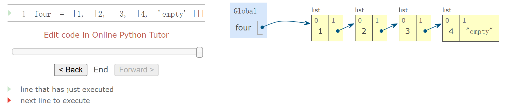
### representation
- A linked list is a pair containing the `first element` of the sequence and the `rest` of the sequence. The second element is also a linked list. 
  
- The rest of the inner-most linked list containing only 4 is **'empty'**, a value that represents an empty linked list.

--> *recursive*!
```py
empty = 'empty'

def is_link(s):
    """s is a linked list if it is `empty` or a (first, rest) pair."""
    return s == empty or (len(s) == 2 and is_link(s[1]))

def link(first, rest):
    """Constructor"""
    assert is_link(rest), "rest must be a linked list."
    return [first, rest]

def first(s):
    """Selector `first element`"""
    assert is_link(s), "first only applies to linked lists."
    assert s != empty, "empty linked list has no first element."
    return s[0]

def rest(s):
    """Selector `rest`"""
    assert is_link(s), "rest only applies to linked lists."
    assert s != empty, "empty linked list has no rest."
    return s[1]
```
construct:
```py
four = link(1, link(2, link(3, link(4, empty))))
```

linked list satisfies the **sequence abstraction**:
```py
def len_link(s):
    """length"""
    length = 0
    while s != empty:
        s, length = rest(s), length + 1
    return length

def getitem_link(s, i):
    """element selection"""
    while i > 0:
        s, i = rest(s), i - 1
    return first(s)
```

### Recursive manipulation
```py
def len_link_recursive(s):
    if s == empty:
        return 0
    return 1 + len_link_recursive(rest(s))

def getitem_link_recursive(s, i):
    if i == 0:
        return first(s)
    return getitem_link_recursive(rest(s), i - 1)
```

```py
def extend_link(s, t):
    """Return a list with the elements of s followed by those of t."""
    assert is_link(s) and is_link(t)
    if s == empty:
        return t
    else:
        return link(first(s), extend_link(rest(s), t))
```

```py
def apply_to_all_link(f, s):
    """Apply f to each element of s."""
    assert is_link(s)
    if s == empty:
        return s
    else:
        return link(f(first(s)), apply_to_all_link(f, rest(s)))
```

```py
def keep_if_link(f, s):
    """Return a list with elements of s for which f(e) is true."""
    assert is_link(s)
    if s == empty:
        return s
    else:
        kept = keep_if_link(f, rest(s))
        if f(first(s)):
            return link(first(s), kept)
        else:
            return kept
```

```py
def join_link(s, separator):
    """Return a string of all elements in s separated by separator."""
    if s == empty:
        return ""
    elif rest(s) == empty:
        return str(first(s))
    else:
        return str(first(s)) + separator + join_link(rest(s), separator)
```

### Recursive Construction
Linked lists are particularly useful when constructing sequences incrementally, a situation that arises often in recursive computations.
```py
def partitions(n, m):
    """Return a linked list of partitions of n using parts of up to m.
    Each partition is represented as a linked list.  
    --> a linked list of linked lists
    """
    if n == 0:
        return link(empty, empty) # A list containing the empty partition
    elif n < 0 or m == 0:
        return empty
    else:
        using_m = partitions(n-m, m)
        with_m = apply_to_all_link(lambda s: link(m, s), using_m)
        without_m = partitions(n, m-1)
        return extend_link(with_m, without_m)

def print_partitions(n, m):
    lists = partitions(n, m)
    strings = apply_to_all_link(lambda s: join_link(s, " + "), lists)
    print(join_link(strings, "\n"))
```
---
# 2.4 Mutable Data
---
## The Object Metaphor
When we included function values among our data, we acknowledged that data too can have behavior. Functions could be manipulated as data, but could
also be called to perform computation.

Objects combine data values with behavior.
Objects are both information and processes, bundled together to represent the properties, interactions, and behaviors of complex things.

The name date is bound to a class. As we have seen, a class represents a kind of value. Individual dates are called instances of that class. Instances can be constructed by calling the class on
arguments that characterize the instance.
```py
from datetime import date
tues = date(2014, 5, 13)
```
**attributes**
```
<expression> . <name>
```
attribute names are not available in the
general environment

methods, which are function-valued attributes
compute their results from both their arguments and their object
```py
>>> tues.strftime('%A, %B %d')
'Tuesday, May 13'
```

In fact, all values in Python are objects. That is, all values have behavior and attributes

## Sequence Objects
### List
Lists are mutable.
Most changes are performed by invoking methods on list
objects.

|   |   |
|---|---|
|   |   |

⚠️distinguish side-effect and return value
```py
>>> s = [1, 2, 3, 4]
>>> s.extend([s.append(9), s.append(10)])
>>> s
>>> [1, 2, 3, 4, 9, 10, None, None]
```

With mutable data, methods called on one name can affect another name
at the same time.

Lists can be copied using the list constructor function

#### lists in environment diagrams
append: 1 more element
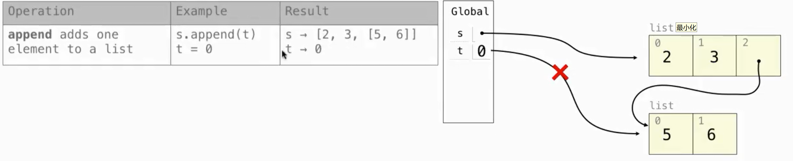
extend: the number of the elements in the parameter list
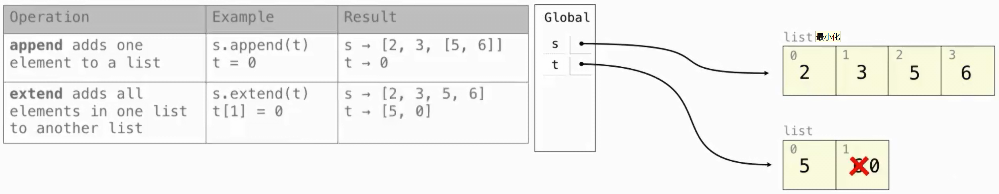
addition and slice: shallow copy
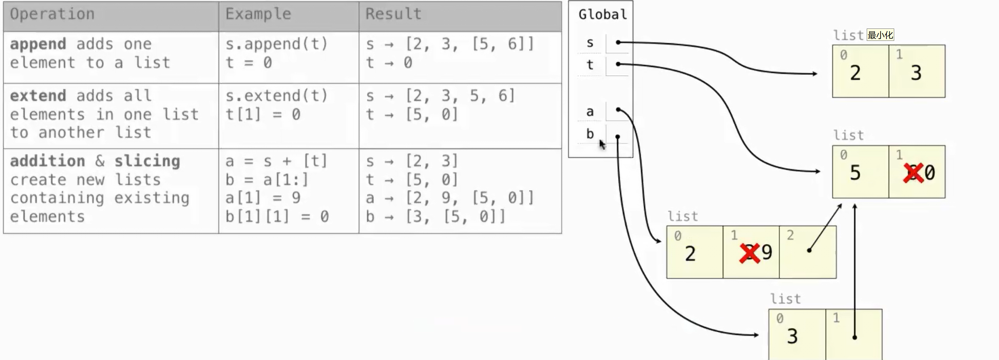
slice assignment: delete -> insert
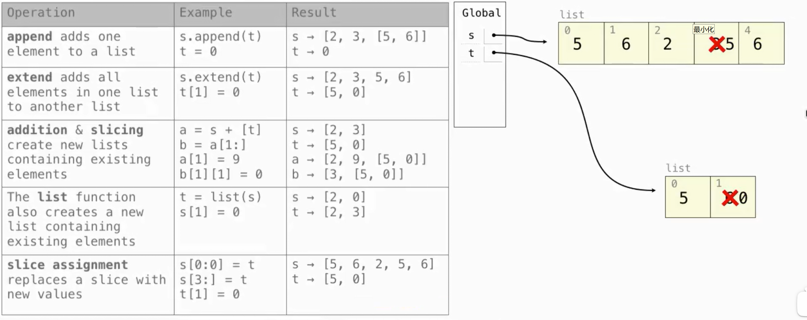
more complex:
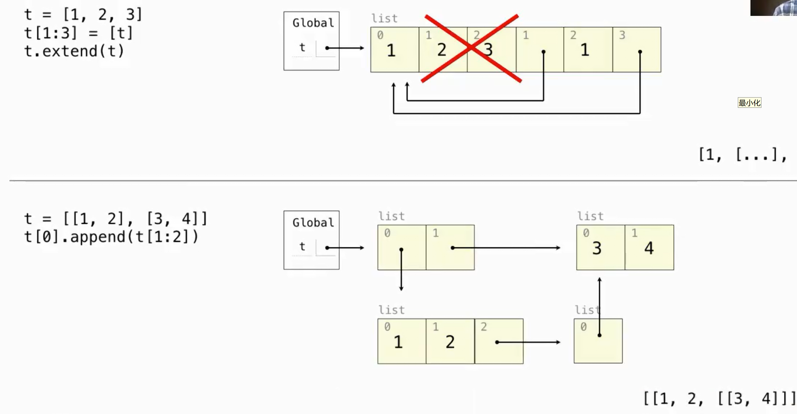

### Sharing and Identity
```py
>>> nest = list(suits) 
>>> nest[0] = suits
>>> suits.insert(2, 'Joker') 
>>> nest
[['heart', 'diamond', 'Joker', 'spade', 'club'], 'diamond', 'spade', 'club']
```

Identity: `is`, `is not`
Equality: `==`

A **list comprehension** always creates a new list object

### Tuples
immutable sequence

tuple literal: separates element expressions by commas. Parentheses are optional but used commonly in practice.
```py
>>> 1, 2 + 3
(1, 5)
>>> ("the", 1, ("and", "only"))
('the', 1, ('and', 'only'))
```
Empty and one-element tuples
```py
>>> () # 0 elements
()
>>> (10,) # 1 element
(10,)
```

|   |   |
|---|---|
|   |   |

```py
>>> code = ("up", "up", "down", "down") + ("left", "right") * 2
>>> len(code)
8
>>> code[3]
'down'
>>> code.count("down")
2
>>> code.index("left")
4
```
the methods for manipulating the contents of a list are not available for tuples
but it is possible to change the value of a
mutable element contained within a tuple

Tuples are used implicitly in multiple assignment. An assignment of two values to two names creates
a two-element tuple and then unpacks it.

## Dictionaries
A dictionary contains **key-value pairs**,  an abstraction for storing and retrieving values that are *indexed* not by consecutive integers, but by descriptive keys.

*unordered* collections of key-value pairs.
cannot predict what that order will be

iterating **keys**, **values**, and **items** all return iterable values.

 `dict` constructor function
```py
>>> dict([(3, 9), (4, 16), (5, 25)])
{3: 9, 4: 16, 5: 25}
```

restrictions:
- A key of a dictionary cannot be or contain a mutable value.
    --> Tuples are commonly used for keys in dictionaries because lists cannot be used.
- There can be at most one value for a given key.


```py
>>> numerals.get('A', 0)
0
>>> numerals.get('V', 0)
5
```

**dictionary comprehension**
```py
{<key exp> : <value exp> for <name> in <iter exp> if <filter exp>}
```
```py
>>> {x: x*x for x in range(3,6)}
{3: 9, 4: 16, 5: 25}
```

## Default Mutable Argument
```py
>>> def f(s = []):  # the same object every time called
        s.append(1)
        return len(s)
>>> f()
1
>>> f()
2
```


## Local State
Lists and dictionaries have local state: they are changing values that have some particular contents at any point in the execution of a program.

Functions can also have local state：
**nonlocal statement**

```py
def make_withdraw(balance):
    """Return a withdraw function that draws down balance with each call."""
    def withdraw(amount):
        nonlocal balance
        # Declare the name "balance" nonlocal
        if amount > balance:
            return 'Insufficient funds'
        balance = balance - amount
        # Re-bind the existing balance name
        return balance
    return withdraw
```
equivalent as:
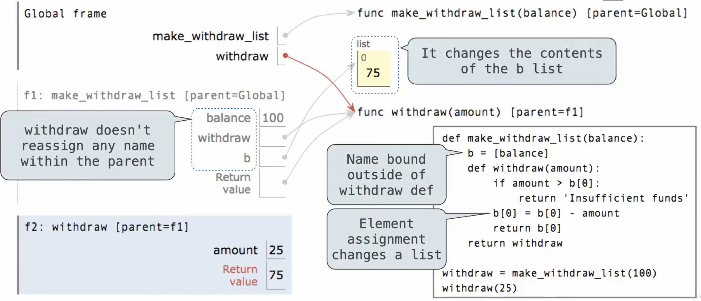

The nonlocal statement declares that whenever we change the binding of the name balance, the binding is changed in the first frame in which balance is already bound.

The nonlocal statement indicates that the name appears somewhere in the environment
other than the first (local) frame or the last (global) frame.

a name outside of the first local frame can be changed by an assignment statement.

The nonlocal statement changes all of the remaining assignment statements in the definition of withdraw.

it will find the first frame
in which balance was already defined and re-bind the name in that frame. If balance has not previously
been bound to a value, then the nonlocal statement will give an error.

By virtue of changing the binding for balance, we have changed the withdraw function as well.

The change to balance from the first call
affects the result of the second call.

both withdraw frames have the same parent. That is, they both extend the environment for make_withdraw. Hence, they share that particular name binding. Calling withdraw has
the side effect of altering the environment that will be extended by future calls to withdraw.

assignment statements: 
- created new bindings 
- re-bound existing names. 
- change the contents of lists and dictionaries.

all instances of a name must refer to the same frame.
```py
def make_withdraw(balance):
def withdraw(amount):
if amount > balance:
return 'Insufficient funds'
balance = balance - amount
return balance
return withdraw
```
UnboundLocalError: local variable 'balance' referenced before assignment

## The Benefits of Non-Local Assignment
If make_withdraw is called again,
then it will create a separate frame with a separate binding for balance.
```py
wd = make_withdraw(20)
wd2 = make_withdraw(7)
wd2(6)
wd(8)
```
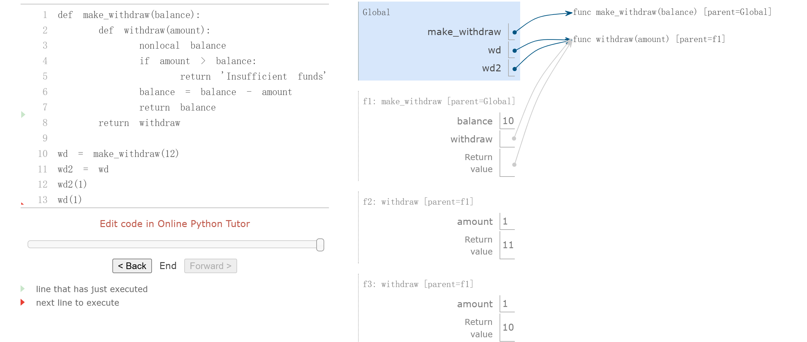
## The Cost of Non-Local Assignment
An expression that
contains only pure function calls is **referentially transparent**; its value does not change if we substitute
one of its subexpression with the value of that subexpression.

Re-binding operations violate the conditions of referential transparency because they do more than
return a value; they change the environment.

## Implementing Lists and Dictionaries
a mutable list could be
represented using functions with local state

we cannot use None to represent an empty
mutable list, because two empty lists are not identical values , but `None is None`

**Dispatch functions** are effectively many functions in one: the message
determines the behavior of the function, and the additional arguments are used in that behavior.

```py
>>> def mutable_link():
        """Return a functional implementation of a mutable linked list."""
        contents = empty
        def dispatch(message, value=None):
        nonlocal contents
        if message == 'len':
        return len_link(contents)
        elif message == 'getitem':
        return getitem_link(contents, value)
        elif message == 'push_first':
        contents = link(value, contents)
        elif message == 'pop_first':
        f = first(contents)
        contents = rest(contents)
        return f
        elif message == 'str':
        return join_link(contents, ", ")
        return dispatch

>>> def to_mutable_link(source):
        """Return a functional list with the same contents as source."""
        s = mutable_link()
        for element in reversed(source):
        s('push_first', element)
        return s

>>> s = to_mutable_link(suits)
>>> print(s('str'))
heart, diamond, spade, club
>>> s('pop_first')
'heart'
>>> print(s('str'))
diamond, spade, club
```
encapsulates the logic for all operations on a data value within one
function that responds to different messages, is a discipline called message passing


### Implementing Dictionaries

```py
>>> def dictionary():
"""Return a functional implementation of a dictionary."""
records = []
def getitem(key):
matches = [r for r in records if r[0] == key]
if len(matches) == 1:
key, value = matches[0]
return value
def setitem(key, value):
nonlocal records
non_matches = [r for r in records if r[0] != key]


records = non_matches + [[key, value]]
def dispatch(message, key=None, value=None):
if message == 'getitem':
return getitem(key)
elif message == 'setitem':
setitem(key, value)
return dispatch

>>> d = dictionary()
>>> d('setitem', 3, 9)
>>> d('setitem', 4, 16)
>>> d('getitem', 3)
9
>>> d('getitem', 4)
16
```

## Dispatch Dictionaries
Instead of
using conditionals to implement dispatching, we can use dictionaries with string keys.

```py
1	def account(initial_balance):
2	    def deposit(amount):
3	        dispatch['balance'] += amount
4	        return dispatch['balance']
5	    def withdraw(amount):
6	        if amount > dispatch['balance']:
7	            return 'Insufficient funds'
8	        dispatch['balance'] -= amount
9	        return dispatch['balance']
10	    dispatch = {'deposit':   deposit,
11	                'withdraw':  withdraw,
12	                'balance':   initial_balance}
13	    return dispatch
14	
15	def withdraw(account, amount):
16	    return account['withdraw'](amount)
17	def deposit(account, amount):
18	    return account['deposit'](amount)
19	def check_balance(account):
20	    return account['balance']
21	
22	a = account(20)
23	deposit(a, 5)
24	withdraw(a, 17)
25	check_balance(a)
```
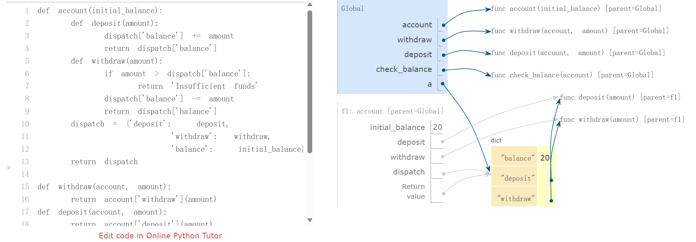
By storing the balance in the dispatch dictionary rather than in
the account frame directly, we avoid the need for nonlocal statements in deposit and withdraw.

## Propagating Constraints
combine nonlocal assignment, lists, and dictionaries to
build a constraint-based system that supports computation in multiple directions

Expressing
programs as constraints is a type of declarative programming, in which a programmer declares the
structure of a problem to be solved, but abstracts away the details of exactly how the solution to the
problem is computed.

```
9 * c = 5 * (f - 32)
```
### Using the Constraint System
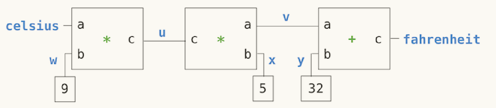
```py
>>> celsius = connector('Celsius')
>>> fahrenheit = connector('Fahrenheit')

>>> def converter(c, f):
"""Connect c to f with constraints to convert from Celsius to Fahrenheit."""
u, v, w, x, y = [connector() for _ in range(5)]
multiplier(c, w, u)
multiplier(v, x, u)
adder(v, y, f)
constant(w, 9)
constant(x, 5)
constant(y, 32)
>>> converter(celsius, fahrenheit)

>>> celsius['set_val']('user', 25)
Celsius = 25
Fahrenheit = 77.0

>>> fahrenheit['set_val']('user', 212)
Contradiction detected: 77.0 vs 212

>>> celsius['forget']('user')
Celsius is forgotten
Fahrenheit is forgotten

>>> fahrenheit['set_val']('user', 212)
Fahrenheit = 212
Celsius = 100.0
```

### Implementing the Constraint System


connector['set_val'](source, value) indicates that the source is requesting the connector to set its
current value to value.
connector['has_val']() returns whether the connector already has a value.
connector['val'] is the current value of the connector.
connector['forget'](source) tells the connector that the source is requesting it to forget its value.
connector['connect'](source) tells the connector to participate in a new constraint, the source.
Constraints are also dictionaries, which receive information from connectors by means of two
messages:
constraint['new_val']() indicates that some connector that is connected to the constraint has a
new value.
constraint['forget']() indicates that some connector that is connected to the constraint has
forgotten its value.

```py
>>> from operator import add, sub
>>> def adder(a, b, c):
"""The constraint that a + b = c."""
return make_ternary_constraint(a, b, c, add, sub, sub)

>>> def make_ternary_constraint(a, b, c, ab, ca, cb):
"""The constraint that ab(a,b)=c and ca(c,a)=b and cb(c,b) = a."""
def new_value():
av, bv, cv = [connector['has_val']() for connector in (a, b, c)]
if av and bv:
c['set_val'](constraint, ab(a['val'], b['val']))
elif av and cv:
b['set_val'](constraint, ca(c['val'], a['val']))
elif bv and cv:
a['set_val'](constraint, cb(c['val'], b['val']))
def forget_value():
for connector in (a, b, c):
connector['forget'](constraint)
constraint = {'new_val': new_value, 'forget': forget_value}
for connector in (a, b, c):
connector['connect'](constraint)
return constraint

>>> from operator import mul, truediv
>>> def multiplier(a, b, c):
"""The constraint that a * b = c."""
return make_ternary_constraint(a, b, c, mul, truediv, truediv)

>>> def constant(connector, value):
"""The constraint that connector = value."""
constraint = {}
connector['set_val'](constraint, value)
return constraint

>>> def connector(name=None):
"""A connector between constraints."""
informant = None
constraints = []
def set_value(source, value):
nonlocal informant
val = connector['val']
if val is None:
informant, connector['val'] = source, value
if name is not None:
print(name, '=', value)
inform_all_except(source, 'new_val', constraints)
else:
if val != value:
print('Contradiction detected:', val, 'vs', value)
def forget_value(source):
nonlocal informant
if informant == source:
informant, connector['val'] = None, None
if name is not None:
print(name, 'is forgotten')
inform_all_except(source, 'forget', constraints)
connector = {'val': None,
'set_val': set_value,
'forget': forget_value,
'has_val': lambda: connector['val'] is not None,
'connect': lambda source: constraints.append(source)}
return connector

>>> def inform_all_except(source, message, constraints):
"""Inform all constraints of the message, except source."""
for c in constraints:
if c != source:
c[message]()
```

The dictionary called constraint / connector is a dispatch dictionary, but also the constraint object itself. It
responds to the two messages that constraints receive, but is also passed as the source argument in
calls to its connectors.

forget-value, which first checks to
make sure that the request is coming from the same constraint that set the value originally


---
# 2.5 Object-Oriented Programming
---
Like the functions in data abstraction, classes create
abstraction barriers between the use and implementation of data
## Objects and Classes
- Class: template 
- Object: instance 


An attribute of an object is a name-value pair associated with the object, which is accessible via dot notation

The attributes specific to a particular object, as opposed to all objects of a class, are called
**instance attributes** / **fields** / **properties** / **instance variables**

Functions that operate on the object or perform object-specific computations are called **methods**

The
return values and side effects of a method can depend upon and change other attributes of the
object

methods are invoked on a particular object

## Defining Classes
Class names are conventionally written using the **CapWords convention / CamelCase**

The method that **initializes** objects, `__init__` , is called the **constructor** for the class.
```py
class Account:
    def __init__(self, account_holder):
        self.balance = 0
        self.holder = account_holder
    def deposit(self, amount):
        self.balance = self.balance + amount
        return self.balance
    def withdraw(self, amount):
        if amount > self.balance:
        return 'Insufficient funds'
        self.balance = self.balance - amount
        return self.balance
```
New objects that have user-defined classes are only created when a class is **instantiated** with call expression syntax.

**Object identity** is compared using the `is` and `is not` operators.

## Message Passing and Dot Expressions
Objects take messages using dot notation, but instead of those messages being arbitrary
string-valued keys, they are names local to a class.

named local state values (the
instance attributes)

state can be accessed and manipulated using dot notation, without
having to employ nonlocal statements

**Dot expressions**
```
<expression> . <name>
```
built-in function `getattr` also returns an attribute for an object by name
```py
getattr(spock_account, 'balance')
```

**Methods and functions**
- as an attribute of a class, a method is just a **function**
- as an attribute of an instance, it is a **bound method**: 
  couple together a function and the object on which that method will be invoked
```py
>>> type(Account.deposit)
<class 'function'>
>>> type(spock_account.deposit)
<class 'method'>
```

```py
>>> Account.deposit(spock_account, 1001) # as function
# The deposit function takes 2 arguments
1011
>>> spock_account.deposit(1000) # as bound method
# The deposit method takes 1 argument
2011
```

## Class Attributes / Class Variables / Static Variables
Some attribute values are shared across all objects of a given class
```py
class Account:
    interest = 0.02
# A class attribute
def __init__(self, account_holder):
    self.balance = 0
    self.holder = account_holder
```
can still be accessed from any instance of the class.
a single assignment statement to a class attribute changes the value of the attribute for all
instances of the class.

**Attribute names**
```py
<expression> . <name>
```
To evaluate a dot expression:
1. `<expression>`: yields the object
2. `<name>`:
- instance: look up instance attribute -> class attribute
- class: look up class attribute

**Attribute assignment**
- If the object is an instance, then assignment sets an instance attribute. 
- If the object is a class, then assignment sets a class attribute. 

As a consequence, *assignment to an attribute of an object cannot affect the attributes of its class*

If we assign to the named attribute `interest` of an account instance, we create a new instance attribute that *has the same name* as the existing class attribute.

## Inheritance
 
- **base class** / **parent class** / **superclass**
- **subclass** / **child class** 

A subclass **inherits** the attributes of its base class, but may **override** certain attributes. 

object metaphor:
- Inheritance: `is-a` relationships between classes
- Composition(attribute): `has-a` relationships
  eg. Bank & Account

## Using Inheritance

```py
class CheckingAccount(Account):
    """A bank account that charges for withdrawals."""
    withdraw_charge = 1     # introduce a class attribute that is specific to the CheckingAccount class
    interest = 0.01         # override
    def withdraw(self, amount):     # override
        return Account.withdraw(self, amount + self.withdraw_charge)    # call ancestor
```

name binding:
- instance: instance attribute -> class attribute -> base class attribute
- class: class attribute -> base class attribute

**Calling ancestors**: Attributes that have been overridden are still accessible via class objects.

Notice that we called `self.withdraw_charge` rather than the equivalent `CheckingAccount.withdraw_charge`.
benefit: a class that inherits from CheckingAccount might override the withdrawal charge. If that is the case, we would like our implementation of withdraw to find that new value instead of the old one.

An **object interface** is a collection of attributes and conditions on those attributes
The classes `Account` and `CheckingAccount` both implement this interface. Inheritance specifically promotes **name sharing** in this way


Do not make assumptions about object types
```py
def deposit_all(winners, amount=5):
    for account in winners:
        account.deposit(amount)
```
Assuming a particular class of account would violate the **abstraction barrier** of the account **object abstraction**
```py
def deposit_all(winners, amount=5):
    for account in winners:
        Account.deposit(account, amount)
```
more complex example:
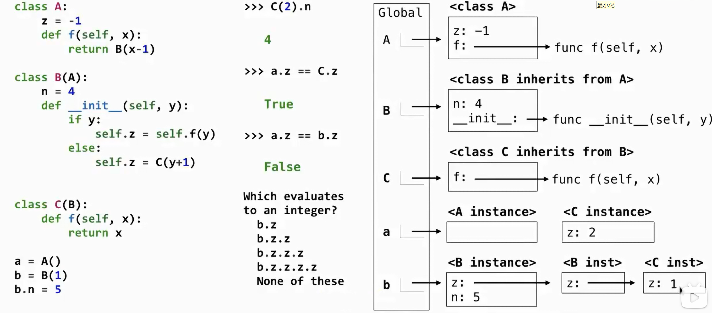
when a C instance is created, the `f` function in `__init__` is in class C instead of A!

## Multiple Inheritance
a subclass may inherit attributes from multiple base classes

```py
class SavingsAccount(Account):
deposit_charge = 2
def deposit(self, amount):
return Account.deposit(self, amount - self.deposit_charge)
```
```py
class AsSeenOnTVAccount(CheckingAccount, SavingsAccount):
def __init__(self, account_holder):
self.holder = account_holder
self.balance = 1
```
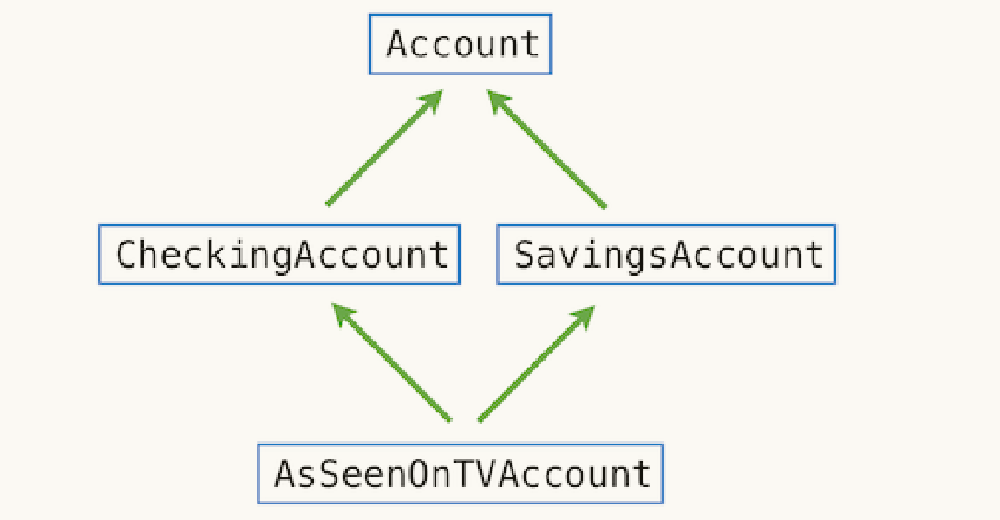
Python resolves names from left to right, then upwards

## The Role of Objects
Object-oriented programming is particularly well-suited to programs that model systems that have *separate but interacting* parts.

On the other hand, classes may not provide the best mechanism for implementing certain abstractions. 
Functional abstractions provide a more natural metaphor for representing relationships between inputs and outputs, which can also enforce a separation of concerns.

---
# 2.6 Implementing Classes and Objects
---


---
# 2.7 Object Abstraction
---

## String Conversion

all objects should produce two different string representations
- `str`: human-interpretable text  
- `repr`: Python-interpretable expression
    The result is what Python prints in an interactive session.
```py
>>> from datetime import date
>>> tues = date(2011, 9, 12)
>>> repr(tues)
'datetime.date(2011, 9, 12)'
>>> str(tues)   # or print(tues)
'2011-09-12'
```

**generic / polymorphic function** can be applied to many (poly) different forms (morph) of data.

ne way to create such a function:
use a shared attribute name with a different definition in each class.

solution in this case: the `repr` function always invokes a method called `__repr__` on its argument. 
The str constructor is implemented in a similar manner
```py
>>> tues.__repr__()
'datetime.date(2011, 9, 12)'
>>> tues.__str__()
'2011-09-12'
```

## String Interpolation 
sub-exprssions are evaluated in the current environment 
the result contains the `str` string of the value of the sub-expressions

## Special Methods
certain special names are invoked by the Python interpreter in special circumstances

### True and false values
By default, objects of user-defined classes are considered to be true, but the special
`__bool__` method can be used to override this behavior
```py
>>> Account.__bool__ = lambda self: self.balance != 0
```

### Sequence operations
The len function invokes the `__len__` method
```py
>>> 'Go Bears!'.__len__()
9
```
Python uses a sequence's length to determine its truth value, if it does not provide a `__bool__` method. Empty sequences are false, while non-empty sequences are true.

The `__getitem__` method is invoked by the element selection operator
```py
>>> 'Go Bears!'.__getitem__(3)
'B'
```

### Callable objects
With `__call__` method, we can define a class that behaves like a higher-order function.
```py
>>> class Adder(object):
        def __init__(self, n):
            self.n = n
        def __call__(self, k):
            return self.n + k
>>> add_three_obj = Adder(3)
>>> add_three_obj(4)
7
```

### Arithmetic
to evaluate expressions that contain the + operator
1. checks for an `__add__` method on the value of the left operand, then checks for an `__radd__` method on the value of the right operand. 
2. If either is found, that method is invoked with the value of the other operand as its argument.


## Multiple Representations
In addition to the data-abstraction barriers that isolate representation from use, we need *abstraction barriers* that isolate different *design choices* from each other and permit different choices to *coexist* in a single program.

>complex 
- ComplexRI constructs a complex number from real and imaginary parts.
- ComplexMA constructs a complex number from a magnitude and angle.

An **interface** is a set of shared attribute names, along with a specification of their behavior

these attributes must be **consistent**

The Complex class implicitly defines this interface by determining how these
attributes are used to add and mul complex numbers.

Python has a simple feature for *computing attributes on the fly* from zero-argument functions. The
`@property` decorator allows functions to be called without call expression syntax

```py
>>> from math import atan2
>>> class ComplexRI(Complex):
        def __init__(self, real, imag):
            self.real = real
            self.imag = imag
        @property
        def magnitude(self):
            return (self.real ** 2 + self.imag ** 2) ** 0.5
        @property
        def angle(self):
            return atan2(self.imag, self.real)
        def __repr__(self):
            return 'ComplexRI({0:g}, {1:g})'.format(self.real, self.imag)
```
## Generic Functions
implement generic functions
- interfaces and message passing
- type dispatching
- type coercion


```py
>>> from fractions import gcd
>>> class Rational(Number):
        def __init__(self, numer, denom):
            g = gcd(numer, denom)
            self.numer = numer // g
            self.denom = denom // g
        def __repr__(self):
            return 'Rational({0}, {1})'.format(self.numer, self.denom)
        def add(self, other):
            nx, dx = self.numer, self.denom
            ny, dy = other.numer, other.denom
            return Rational(nx * dy + ny * dx, dx * dy)
        def mul(self, other):
            numer = self.numer * other.numer
            denom = self.denom * other.denom
            return Rational(numer, denom)
```

### type dispatching

- built-in function `isinstance`
- user-defined function
```py
def is_real(c):
    """Return whether c is a real number with no imaginary part."""
    if isinstance(c, ComplexRI):
        return c.imag == 0
    elif isinstance(c, ComplexMA):
        return c.angle % pi == 0
```
- give a type_tag attribute

```py
class Number:
    def __add__(self, other):
        if self.type_tag == other.type_tag:
            return self.add(other)
        elif (self.type_tag, other.type_tag) in self.adders:
            return self.cross_apply(other, self.adders)
    def __mul__(self, other):
        if self.type_tag == other.type_tag:
            return self.mul(other)
        elif (self.type_tag, other.type_tag) in self.multipliers:
            return self.cross_apply(other, self.multipliers)
    def cross_apply(self, other, cross_fns):
        cross_fn = cross_fns[(self.type_tag, other.type_tag)]
        return cross_fn(self, other)
    adders = {("com", "rat"): add_complex_and_rational,
    ("rat", "com"): add_rational_and_complex}
    multipliers = {("com", "rat"): mul_complex_and_rational,
    ("rat", "com"): mul_rational_and_complex}
```
### type coercion
Often the different data types are not completely
independent, and there may be ways by which objects of one type may be viewed as being of
another type. This process is called **coercion**

```py
class Number:
    def __add__(self, other):
        x, y = self.coerce(other)
        return x.add(y)
    def __mul__(self, other):
        x, y = self.coerce(other)
        return x.mul(y)
    def coerce(self, other):
        if self.type_tag == other.type_tag:
            return self, other
        elif (self.type_tag, other.type_tag) in self.coercions:
            return (self.coerce_to(other.type_tag), other)
        elif (other.type_tag, self.type_tag) in self.coercions:
            return (self, other.coerce_to(self.type_tag))
    def coerce_to(self, other_tag):
        coercion_fn = self.coercions[(self.type_tag, other_tag)]
        return coercion_fn(self)
    coercions = {('rat', 'com'): rational_to_complex}
```

may try to coerce two different types each into *a third common type*
eg. a rhombus and a rectangle: neither is a special case of the other, but both can be viewed as quadrilaterals

drawbacks. *lose information*

---
# 2.8 Efficiency
---

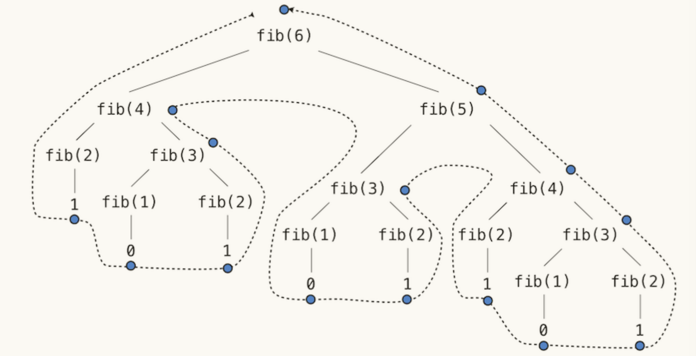

**Space**
An environment is **active** if it provides the evaluation context for some expression being evaluated. 
An environment becomes **inactive** whenever the function call *for which its first frame was created* finally *returns*.

In general, the space required for tree-recursive functions will be proportional to the *maximum depth of the tree.*

---
# 2.9 Recursive Objects
---
## Link Class
```py
class Link:
    """A linked list is either a Link object or Link.empty
    """
    empty = ()

    def __init__(self, first, rest=empty):
        assert rest is Link.empty or isinstance(rest, Link)
        self.first = first
        self.rest = rest

    def __repr__(self):
        if self.rest:
            rest_repr = ', ' + repr(self.rest)
        else:
            rest_repr = ''
        return 'Link(' + repr(self.first) + rest_repr + ')'

    def __str__(self):
        string = '<'
        while self.rest is not Link.empty:
            string += str(self.first) + ' '
            self = self.rest
        return string + str(self.first) + '>'
    def __getitem__(self, i):
        if i == 0:
        return self.first
        else:
        return self.rest[i-1]
    def __len__(self):
        return 1 + len(self.rest)
```
### manipulate link
by **attribute assignment** 

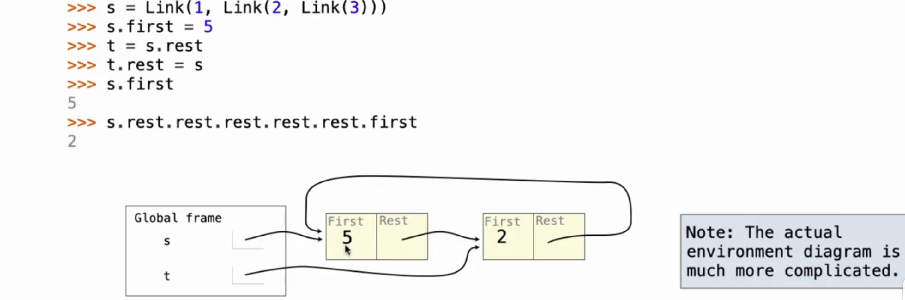

make clear if you want to:
- **modify** an object
  ```py
  s.first, s.rest = ...     # attribute assignment
  ...
  (return s)
  ```
- **construct** a new object
  ```py
  if s is Link.empty:   # base case
    return ...      
  return Link(s.first, ...)     # construct
  ```

## Tree Class
```py
class Tree:
    def __init__(self, label, branches=[]):
        self.label = label
        for branch in branches:
            assert isinstance(branch, Tree)
        self.branches = list(branches)
    
    def __repr__(self):
        if self.branches:
            return 'Tree({0}, {1})'.format(self.label, repr(self.branches))
        else:
            return 'Tree({0})'.format(repr(self.label))

    def is_leaf(self):
        return not self.branches
```
### manipulate tree

>prune subtrees
```py
def prune(t, x):
    """prune subtrees with label x
    the root node will not be removed"""

    t.branches = [b for b in t.branches if b.label != x]    # attribute assignment
    for b in t.branches:
        prune(b, x)
```
>delete nodes
```py
def delete(t, x):
    """Remove all nodes labeled x below the root within Tree t. When a non-leaf
    node is deleted, the deleted node's children become children of its parent.

    The root node will never be removed."""

    new_branches = []
    for b in t.branches:
        delete(b, x)
        if b.label == x:
            new_branches += b.branches
        else:
            new_branches.append(b)
    t.branches = new_branches   # attribute assignment
```

## Sets