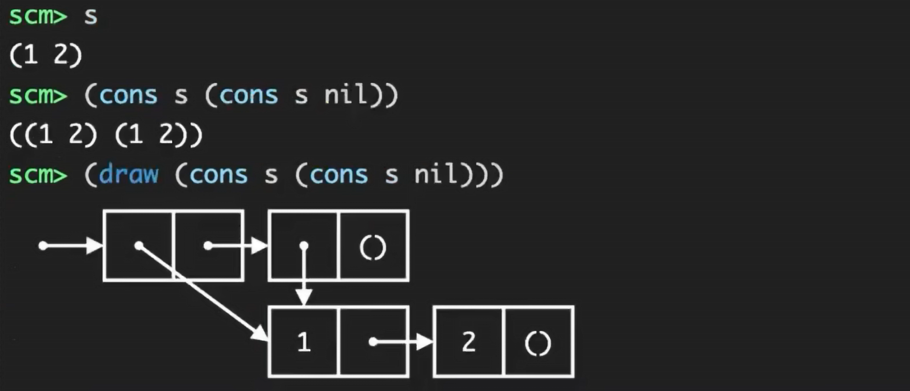

# <center> Chapter 3: Interpreting Computer Programs
---
<!-- pagebreak -->

# 3.1 Introduction
---
fundamental elements of programming:
- functions
- data
- programs themselves
- interpreter, which determines the meaning of expressions in a programming language, is just another
program.

---
# 3.2 Functional Programming
---
**Functional programming** is a programming paradigm where programs are constructed by *applying and composing functions*. It is a **declarative** programming paradigm in which function definitions are *trees of expressions* that map values to other values, rather than a sequence of **imperative** statements which update the running *state* of the program."
- pure functions
- no re-assignment, no mutable data types
- name-bindings are permanent

**adventages:**
- the value of expression is independent of the order in which sub-expressions are evaluated 
- sub-expressions can be evaluated in parallel or lazily
- referential transparent


Scheme language uses only expressions (no statements), specializes in **symbolic computation**, and employs only immutable values.
## Expressions
exclusively uses **prefix notation**
```scheme
(+ (* 3
    (+ (* 2 4)
        (+ 3 5)))
    (+ (- 10 7)
        6))
```
```scheme
(>= 2 1)
```
### primitives
Atomic expressions (also called atoms) are expressions without sub-expressions, such as numbers, boolean values, and symbols.
### combinations
```scheme
(<operator> <operand1> <operand2> ...)
```
#### call expressions

#### special forms
  
**If Expressions**
```scheme
(if <predicate> <consequent> <alternative>)
```

boolean values #t (or true) and #f (or false)
```scheme
(and <e1> ... <en>)
(or <e1> ... <en>)
(not <e>)
```
**Define**
```scheme
(define (<name> <formal parameters>) <body>)
```
```scheme
(define (sqrt x)
    (define (good-enough? guess)
        (< (abs (- (square guess) x)) 0.001))
    (define (improve guess)
        (average guess (/ x guess)))
    (define (sqrt-iter guess)
        (if (good-enough? guess)
        guess
        (sqrt-iter (improve guess))))
    (sqrt-iter 1.0))
(sqrt 9)
```
**Lambda**
```scheme
(lambda (<formal-parameters>) <body>)
```
can be used as the operator in a call expression

**Cond Expressions**: The cond special form can include multiple predicates (like if/elif in Python):
```scheme
(cond
    (<p1> <e1>)
    (<p2> <e2>)
    ...
    (<pn> <en>)
    (else <else-expression>))
```
**Let**
create local bindings
```scheme
(let ((var-1 expr-1)
      (var-2 expr-2)
      ...
      (var-n expr-n))
      body-expr)
```
```scheme
(define (filter fn lst)
    (if (null? lst)
        nil
        (let ((first (car lst))
              (rest (cdr lst)))
           (if (fn first)
               (cons first (filter fn rest))
               (filter fn rest)))))
```

## Compound values
**Pairs** 
created with the `cons` built-in function
elements of a pair are accessed with `car` and `cdr`

**Recursive lists**
`nil`: the empty list
```scheme
(cons 1
    (cons 2
        (cons 3
            (cons 4 nil))))
(list 1 2 3 4)
(define one-through-four (list 1 2 3 4))
(car one-through-four)
1
(cdr one-through-four)
(2 3 4)
(car (cdr one-through-four))
2
(cons 10 one-through-four)
(10 1 2 3 4)
```
```scheme
scm> (list 1 2 3)
(1 2 3)
scm> (list 1 (list 2 3) 4)
(1 (2 3) 4)
scm> (list (cons 1 (cons 2 nil)) 3 4)
((1 2) 3 4)
```


### Built-In Procedures for Lists

Using `null?` predicate, we can define the standard sequence operations for **computing length** and **selecting elements**:
```scheme
(define (length items)
    (if (null? items)
        0
        (+ 1 (length (cdr items)))))
(define (getitem items n)
    (if (= n 0)
        (car items)
        (getitem (cdr items) (- n 1))))
```
```scheme
scm> (null? nil)                ; Checks if a value is the empty list
True
scm> (append '(1 2 3) '(4 5 6)) ; Concatenates two lists
(1 2 3 4 5 6)
scm> (length '(1 2 3 4 5))      ; Returns the number of elements in a list
5
```

## Symbolic Data
In Scheme, any expression that is not evaluated is said to be **quoted**
use single quotation mark `'`
```scheme
(define a 1)
(define b 2)
(list a b)
(1 2)
(list 'a 'b)
(a b)
```

Quotation can be applied to combinations to form lists:
```scheme
(car '(a b c))
a
```

## Turtle graphics
the turtle has a position and heading on the canvas
Single-argument procedures such as forward and right change the position
and heading of the turtle.

recursive drawings
>Sierpinski's triangle
```scheme
> (define (repeat k fn)
    (if (> k 0)
        (begin (fn) 
        (repeat (- k 1) fn))
        nil))
> (define (tri fn)
    (repeat 3 (lambda () (fn) (lt 120))))
> (define (sier d k)
    (tri (lambda ()
    (if (= k 1) (fd d) (leg d k)))))
> (define (leg d k)
    (sier (/ d 2) (- k 1))
    (penup)
    (fd d)
    (pendown))
```


---
# 3.3 Exceptions
---

Error examples abound: 
a function may not receive arguments that it is designed to accept, 
a necessary resource
may be missing
a connection across a network may be lost.

no single correct approach to handling errors
- Programs designed to provide
some persistent service like a web server should be robust to errors,
- Python interpreter handles errors by terminating immediately

**Raising an exception** is a technique for interrupting the normal flow of execution in a program, signaling that some exceptional circumstance has arisen, and returning directly to an enclosing part of the program that was designated to react to that circumstance.

An exception is a object instance with a class that inherits from the **BaseException** class. 
The `assert` statement raises an exception with the class **AssertionError**. 
In general, any exception instance can be raised with the `raise` statement

```py
>>> raise Exception('An error occurred')
Traceback (most recent call last):
File "<stdin>", line 1, in <module>
Exception: an error occurred
```
the file name `<stdin>` indicates that the exception was raised by the user in an interactive
session, rather than from code in a file.

**Handling exceptions**
`try` statement
```py
try:
    <try suite>
except <exception class> as <name>:
    <except suite>
```
the identifier `<name>` is bound to the exception object that was raised, but this binding does not persist beyond the `<except suite>`.

A try statement will handle exceptions that occur within the body of a function that is *applied (either directly or indirectly) within* the `<try suite>`. 
When an exception is raised, control jumps directly to the body of the `<except suite>` of the *most recent try statement that handles that type of exception.*
```py
>>> def invert(x):
        result = 1/x # Raises a ZeroDivisionError if x is 0
        print('Never printed if x is 0')
        return result
>>> def invert_safe(x):
        try:
            return invert(x)
        except ZeroDivisionError as e:
            return str(e)
>>> invert_safe(2)
Never printed if x is 0
0.5
>>> invert_safe(0)
'division by zero'
```

## Exception Objects

Exception objects themselves can have **attributes**
such as the error message stated in an assert statement and information about where in the course of execution the exception was raised.
>find the zero of $2x^2 + \sqrt{x}$

returns the best guess discovered in the course of iterative improvement whenever a `ValueError` occurs
```py
>>> class IterImproveError(Exception):  # User-defined exception classes
        def __init__(self, last_guess):
            self.last_guess = last_guess
>>> def improve(update, done, guess=1, max_updates=1000):
        k = 0
        try:
            while not done(guess) and k < max_updates:
                guess = update(guess)   # A math domain error (a type of ValueError) is raised when sqrt is applied to a negative number.
                k = k + 1
            return guess
        except ValueError:
            raise IterImproveError(guess)
>>> def find_zero(f, guess=1):
        def done(x):
            return f(x) == 0
        try:
            return improve(newton_update(f), done, guess)
        except IterImproveError as e:
            return e.last_guess
>>> from math import sqrt
>>> find_zero(lambda x: 2*x*x + sqrt(x))
-0.030211203830201594
```

separate the logic for iterative improvement, which appears unchanged in the suite of the try clause, from the logic for handling errors, which appears in except clauses.

---
# 3.4 Interpreters for Languages with Combination
---
**Metalinguistic abstraction** : establishing new languages

An **interpreter** for a programming language is a *function* that
- *applied to an expression* of the language
- *performs the actions* required to evaluate that expression.
## Parsing Expressions
**Parsing** is the process of *generating expression trees* from raw text input
**parser**：
- **Lexical analysis**
partitions the input string into tokens, which are the minimal syntactic units of the language such as names and symbols.

- **Syntactic analysis**
constructs an expression tree from this sequence of tokens

## Calculator Evaluation
```py
def calc_eval(exp):
    """Evaluate a Calculator expression."""
    if type(exp) in (int, float):
        return simplify(exp)
    elif isinstance(exp, Pair):
        arguments = exp.second.map(calc_eval)
        return simplify(calc_apply(exp.first, arguments))
    else:
        raise TypeError(exp + ' is not a number or call expression')
```
```py
def calc_apply(operator, args):
    """Apply the named operator to a list of args."""
    if not isinstance(operator, str):
        raise TypeError(str(operator) + ' is not a symbol')
    if operator == '+':
        return reduce(add, args, 0)
    elif operator == '-':
        if len(args) == 0:
        raise TypeError(operator + ' requires at least 1 argument')
        elif len(args) == 1:
        return -args.first
        else:
        return reduce(sub, args.second, args.first)
    elif operator == '*':
        return reduce(mul, args, 1)
    elif operator == '/':
        if len(args) == 0:
        raise TypeError(operator + ' requires at least 1 argument')
        elif len(args) == 1:
        return 1/args.first
        else:
        return reduce(truediv, args.second, args.first)
    else:
    raise TypeError(operator + ' is an unknown operator')
```

**Read-eval-print loops**
interacting with an interpreter
```py
def read_eval_print_loop():
    """Run a read-eval-print loop for calculator."""
    while True:
        try:
            src = buffer_input()
            while src.more_on_line:
            expression = scheme_read(src)
            print(calc_eval(expression))
        except (SyntaxError, TypeError, ValueError, ZeroDivisionError) as err:
            print(type(err).__name__ + ':', err)
        except (KeyboardInterrupt, EOFError): # <Control>-D, etc.
            print('Calculation completed.')
            return
```
- parsing function
- evaluation function
- exception types handling

---
# Interpreters for Languages with Abstraction
---
## Data as Programs

programs are data
expressions are lists
- From the perspective of the user, an input expression such as (+ 2 2) is an expression in the programming language, which the interpreter should evaluate. 
- From the perspective of the Scheme interpreter, the expression is simply a sentence of words that is to be manipulated according to a well-defined set of rules.
  
```scheme
(define code '(+ 1 2))
(eval code) 
```
---
# Tail Calls
---


A function call f(x) is a **tail call** if:
- It is the ​​*final operation*​​ in the function (i.e., no operations depend on its result).
- The return value of f(x) is ​*​directly returned*​​ by the caller, *no furthur computation*.

A **tail call** is a call expression in a **tail context**: 
- The last body sub-expression in a lambda expression (or procedure definition) 
- Sub-expressions 2 & 3 in a tail context `if` expression 
- All non-predicate sub-expressions in a tail context `cond` 
- The last sub-expression in a tail context `and`, `or`, `begin`, or `let` 
  
A Scheme interpreter should support an unbounded number of **active** (not yet returned) tail calls *using only a constant amount of **space**.*


A recursive procedure is **tail recursive** if *all* of its recursive calls are tail calls
 
*Linear recursive* procedures can often be re-written to use tail calls
```py
def fact_k(n, k): 
    if n == 0: 
        return k 
    else: 
        return fact_k(n - 1, n*k)
def fact_k(n, k): 
    while n > 0: 
            n, k = n - 1, k * n 
    return k
```

use *extra parameter to keep track of progress so far*
>map

iter:
```scheme
(define (map procedure s) 
  (if (null? s)  
        nil  
      (cons (procedure (car s))  
            (map 
    procedure (cdr s))) ) )
```
tail call:
```scheme
(define (map procedure s) 
  (define (map-reverse s m) 
    (if (null? s)  
        m 
        (map-reverse (cdr s) 
                     (cons 
                        (procedure (car s))  
                        m))               ) ) 
  (reverse (map-reverse s nil))) 

(define (reverse s) 
  (define (reverse-iter s r) 
    (if (null? s)  
        r 
        (reverse-iter (cdr s) 
                      (cons 
                        (reverse-iter s nil))
                        (car s) r)) ) ) 
```
