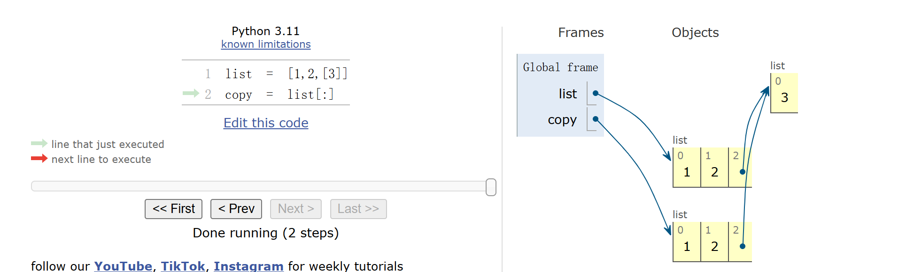

`super()`   call ancestors
```py
class Shape:
    """All geometric shapes will inherit from this Shape class."""
    def __init__(self, name):
        self.name = name

    def area(self):
        """Returns the area of a shape"""
        print("Override this method in ", type(self))

    def perimeter(self):
        """Returns the perimeter of a shape"""
        print("Override this function in ", type(self))

class Circle(Shape):
    """A circle is characterized by its radii"""
    def __init__(self, name, radius):
        super().__init__(name)
        self.radius = radius

    def perimeter(self):
        """Returns the perimeter of a circle (2πr)"""
        return 2*pi*self.radius

    def area(self):
        """Returns the area of a circle (πr^2)"""
        return pi*self.radius**2

class RegPolygon(Shape):
    """A regular polygon is defined as a shape whose angles and side lengths are all the same.
    This means the perimeter is easy to calculate. The area can also be done, but it's more inconvenient."""
    def __init__(self, name, num_sides, side_length):
        super().__init__(name)
        self.num_sides = num_sides
        self.side_length = side_length

    def perimeter(self):
        """Returns the perimeter of a regular polygon (the number of sides multiplied by side length)"""
        return self.num_sides*self.side_length
class Square(RegPolygon):
    def __init__(self, name, side_length):
        super().__init__(name, 4, side_length)

    def area(self):
        """Returns the area of a square (squared side length)"""
        return self.side_length**2

class Triangle(RegPolygon):
    """An equilateral triangle"""
    def __init__(self, name, side_length):
        super().__init__(name, 3, side_length)

    def area(self):
        """Returns the area of an equilateral triangle is (squared side length multiplied by the provided constant"""
        constant = math.sqrt(3)/4
        return constant*self.side_length**2
```


---
from `ants`
```py
class FireAnt(Ant):
    """FireAnt cooks any Bee in its Place when it expires."""

    name = 'Fire'
    damage = 3
    food_cost = 5
    implemented = True 

    def __init__(self, health=3):
        """Create an Ant with a HEALTH quantity."""
        super().__init__(health)

    def reduce_health(self, amount):
        """Reduce health by AMOUNT, and remove the FireAnt from its place if it
        has no health remaining.

        Make sure to reduce the health of each bee in the current place, and apply
        the additional damage if the fire ant dies.
        """
        # BEGIN Problem 5
        "*** YOUR CODE HERE ***"
        place = self.place
        bees = place.bees[:]
        Ant.reduce_health(self, amount)
        fire = amount + self.damage if self.health <= 0 else amount
        for b in bees:
            b.reduce_health(fire)
        # place.bees = bees         wrong!!!
```
- why can we change the original object by manipulating a copy?
    copy and slice of lists:
    **Shallow Copy**: the same object!!!
    

    


- why adding the last line cause error?
    you are just changing the attribute of the bees but never removed it from the list
    so place.bees = a list of bees whose attribute `place` may be `None` (not **consistent**)

---

from `ants`
```py
class SlowThrower(ThrowerAnt):
    """ThrowerAnt that causes Slow on Bees."""

    name = 'Slow'
    food_cost = 6
    # BEGIN Problem EC 1
    implemented = True   # Change to True to view in the GUI
    # END Problem EC 1

    def throw_at(self, target):
        # BEGIN Problem EC 1
        "*** YOUR CODE HERE ***"
        target.slow_turns = 5

        ori_action = target.action
        def slow_action(gamestate):
            if gamestate.time % 2 == 0:
                ori_action(gamestate)
            target.slow_turns -= 1
            if target.slow_turns <= 0:
                target.action = ori_action
                
        target.action = slow_action
        # END Problem EC 1
```

---
```py
class Coin:
    cents = None # will be provided by subclasses, but not by Coin itself

    def __init__(self, year):
        self.year = year

    def worth(self):
        "*** YOUR CODE HERE ***"
        present_year = Mint().present_year
        extra = 0
        if present_year - self.year - 50 > 0:
            extra = present_year - self.year - 50
        if self.cents:
            return self.cents + extra

class Nickel(Coin):
    cents = 5

class Dime(Coin):
    cents = 10
```
虽然调用的方法是继承 Coin 的，但是 self.cents 仍然从自己开始找